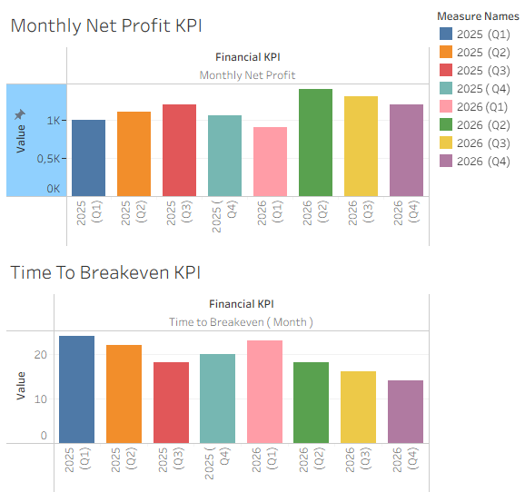

📌 Extramus – Franchise & Partnership Project
📝 Project Description

This project explored the feasibility of scaling Extramus, a nonprofit internship mobility organization in Italy.

At first, the goal was to design a franchising model to replicate the Extramus concept in other Italian towns. Later, due to financial constraints (no EU funding, limited revenue sources), the project pivoted into a partnership model, positioning Extramus as a middleman between companies seeking interns and students looking for internship opportunities.

My role as Finance Intern was to provide the financial backbone of the project: revenue–expense models, KPIs, and scenario analyses that could guide strategic decisions.

🎯 My Contributions

Financial Modeling

Built two income statements (franchisor & franchisee perspective).

Conducted break-even analysis, estimating that 8 interns would cover operational costs.

Designed scenario analyses (Best–Moderate–Worst cases).

KPI Development & Visualization

Created Operational, Financial, and Impact KPIs tailored to nonprofit context.

Visualized KPIs in Tableau dashboards for easier tracking.

Pricing & Revenue Strategy

Designed student pricing models by sector (IT, Marketing, HR).

Estimated productivity value per intern and built fee-sharing scenarios (10%, 15%, 20%).

Partnership Model

Adapted financial models for a service-based approach where Extramus charges companies for successful intern placements.

Drafted a business proposal including three services:

Website creation for SMEs without online presence,

Internship placement service,

Collaboration on visionary nonprofit projects (leveraging Google for Nonprofits).

Research & Benchmarking

Analyzed AIESEC and ESN as social franchise case studies.

Identified similarities, differences, and lessons for Extramus.

📊 Key Skills Developed

Hard Skills: Financial Modeling, Scenario Analysis, KPI Development, Budgeting, Pricing Strategy, Data Visualization (Excel, Tableau).

Soft Skills: Strategic Thinking, Problem-Solving, Adaptability, Cross-Cultural Teamwork, Professional Communication.

✅ Outcomes

Determined that a franchising model is not financially feasible in the short term without external funding (e.g., EU grants).

Produced a scalable partnership model where Extramus monetizes its role as an intermediary between companies and interns.

Delivered financial templates, scenario analyses, and KPIs that can be reused for future franchise or partnership opportunities.

Contributed to the Extramus Partnership Program proposal, providing a clear financial perspective to complement strategic and operational inputs.

🔎 Conclusion

This project showed that nonprofits need flexible, sustainable models to expand. While franchising appeared attractive at first, the financial reality made it impractical. By pivoting to a partnership strategy, Extramus can:

Leverage its strong supply of interns,

Generate revenue with minimal cost,

Build trust with companies through added-value services,

Keep the door open for future franchising once financial stability and external funding are secured.

For me, the internship was a hands-on lesson in how financial modeling directly informs strategic decisions. I learned to balance optimism with realism, adapt quickly to new directions, and communicate financial insights in a way that supports leadership decisions.
